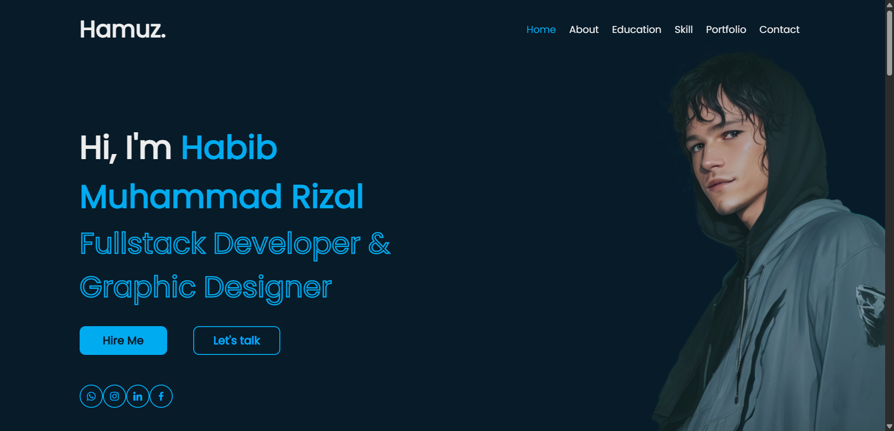
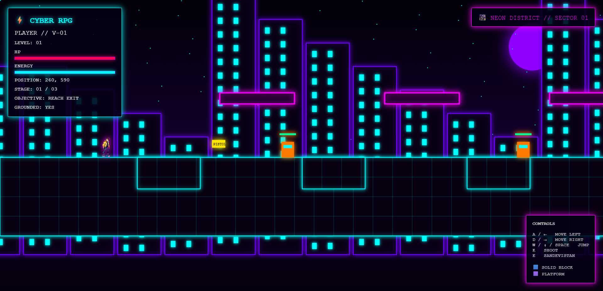

<!-- ======================= HEADER ======================= -->

# ⚡ HABIB MUHAMMAD RIZAL

### `WEB DEVELOPER` • `UI/UX DESIGNER` • `DATA ANALYST` • `GAME DEVELOPER`

 

## 🧬 About Me

### 👋 Hi, I'm **Habib Muhammad Rizal**

**Web Developer • UI/UX Designer • Data Analyst • Game Developer**

 

I’m a developer and designer who enjoys turning ideas into  
**functional websites, creative interfaces, useful data insights, and interactive experiences.**

  

| 💻 Web Development | 🎨 UI/UX Design |
|:---:|:---:|
| Building modern & responsive websites | Creating clean & intuitive interfaces |

| 📊 Data Analysis | 🎮 Game Development |
|:---:|:---:|
| Turning data into meaningful insights | Creating interactive digital experiences |

 

**⚡ Learn → Build → Analyze → Improve**

🚀 PORTFOLIO

## 🚀 PORTFOLIO

<table>
<tr>

<!-- ================= PROJECT 1 ================= -->

<td width="50%" align="center">

 🌐 Portfolio Website

**Personal portfolio website**

`HTML` • `CSS` • `JavaScript`

Responsive & Modern UI

 

</td>

<!-- ================= PROJECT 2 ================= -->

<td width="50%" align="center">

 🎮 Cyberpunk Pixel RPG

**Pixel RPG / Web Game**

`HTML` • `CSS` • `JavaScript` • `Canvas`

Interactive Pixel Game

 

</td>

</tr>

<!-- ================= BARIS 2 ================= -->

<tr>

<td width="50%" align="center">

🖥️ Web Development Project

**Modern Web Application**

`HTML` • `CSS` • `JavaScript`

Responsive & Interactive

 

</td>

<td width="50%" align="center">

📊 Data Analysis Project

**Data Analysis & Visualization**

`Python` • `Pandas` • `Matplotlib`

Data-driven Insights

 

</td>

</tr>

</table>

